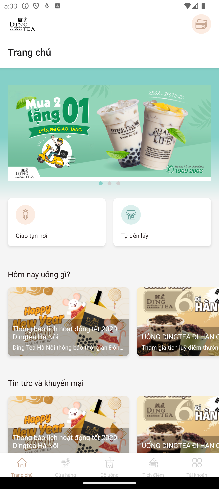
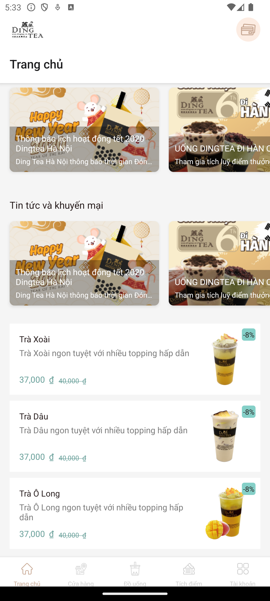
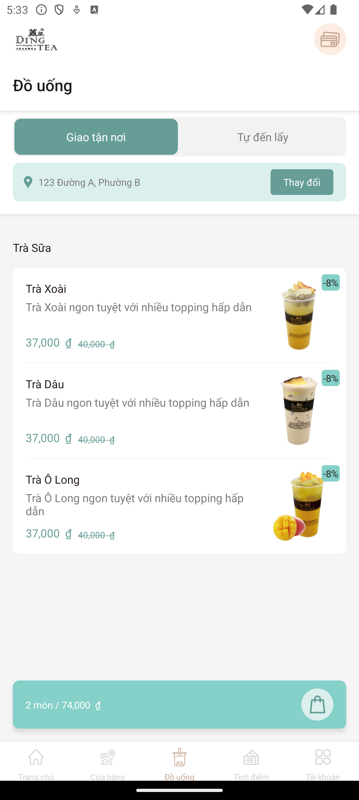
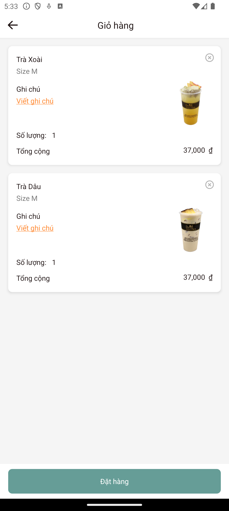
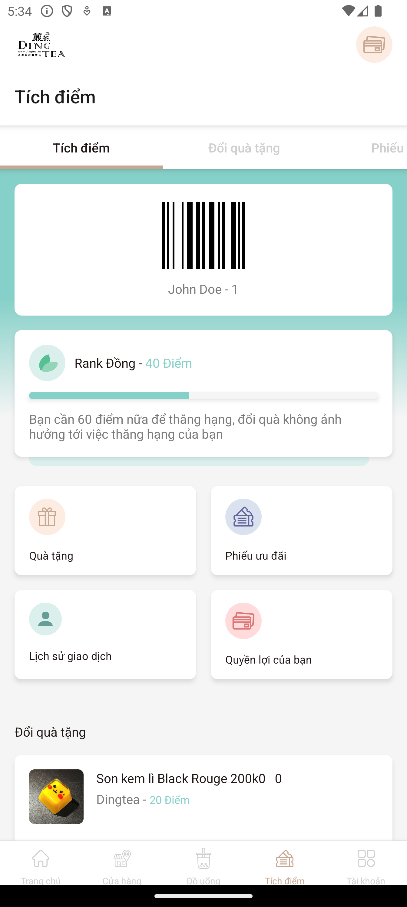
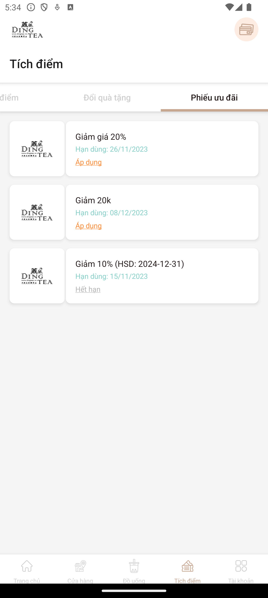
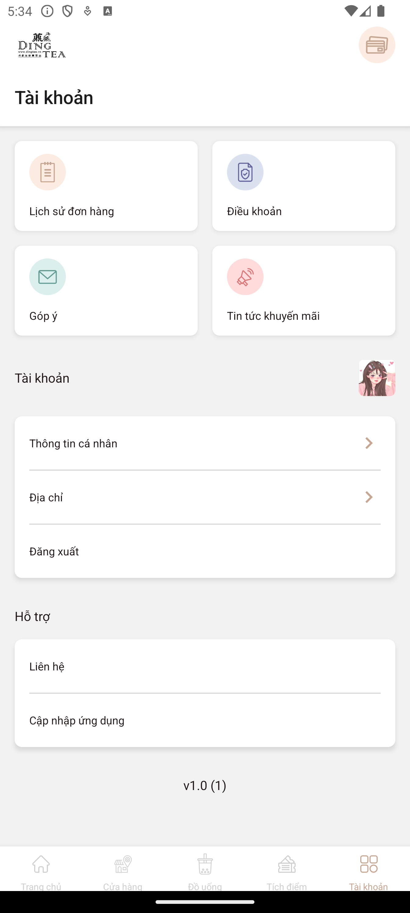

## 💝 Ủng hộ tôi

### Nếu bạn thấy dự án của tôi hữu ích và muốn ủng hộ tôi, hãy quét mã QR bên dưới:

|                                                                              |  |  |  |
|-------------------------------------------------------------------------------------------------------------------------------|-----------------------------------|---------------------------------------------------|-----------------------------------|
| **Momo:&nbsp;&nbsp;&nbsp;&nbsp;&nbsp;&nbsp;&nbsp;&nbsp;&nbsp;&nbsp;&nbsp;&nbsp;&nbsp;&nbsp; 0981054498 - NGUYEN ANH DAT** | **Thank you 🙌**                  | **Techcombank: 1981054498 - NGUYEN ANH DAT**  | **Thank you 🙌**                  |

### Cảm ơn sự hào phóng của bạn! 🙌

---

## Giới thiệu ứng dụng DingTea

### Mô tả

- Ứng dụng **DingTea** là một ứng dụng bán trà sửa, ngôn ngữ lập trình là `React Native`. Tôi code đầy đủ tính năng và. Tôi cũng đã cập nhật, bạn chỉ cần tải về và chạy. Bạn có thể dùng **DingTea** như một tài liệu tham khảo hoặc dùng làm bài tập của mình.
- Ứng dụng **DingTea** có các tính năng cơ bản của một ứng dụng thương mại điện tử, người dùng có thể đăng ký và đăng nhập, xem thông tin sản phẩm và khuyến mại, tạo và theo dõi đơn hàng,...
- Ứng dụng **DingTea** sử dụng các file json để làm backend. Thư mục src > services > mock chứa các file json. Dữ liệu của file json chính là dữ liệu trả về của API. Do chưa có thời gian nên tôi chưa viết API mà dùng cách này. Bạn có thể tự viết API để làm bài tập tốt hơn.

### Chạy thử

- Số điện thoại: **0987654321**
- Mã OTP: **123456**

#### Màn hình

|  |   |  |  | 
|----------------------------------|-----------------------------------|----------------------------------|----------------------------------|
|  |   |  |  |